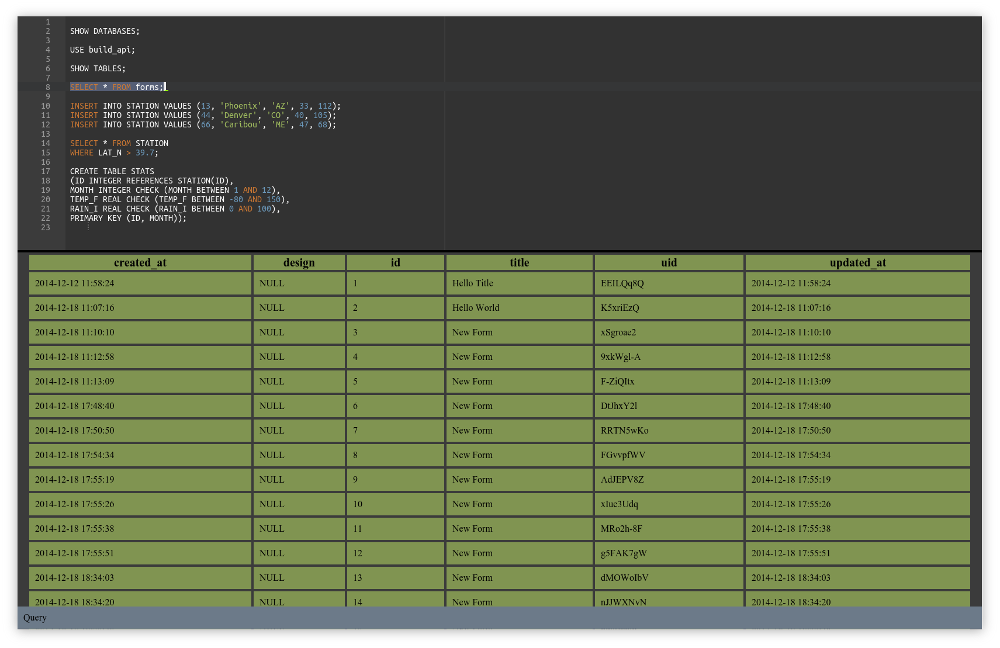

Executer
============

Fluid UI for browsing and manipulating data and structure in MySQL database.

TODO
===========
* Fix EventEmitter leak

Notes
===========
Snapshot of UI here: http://jsbin.com/yufesipito/4/edit
